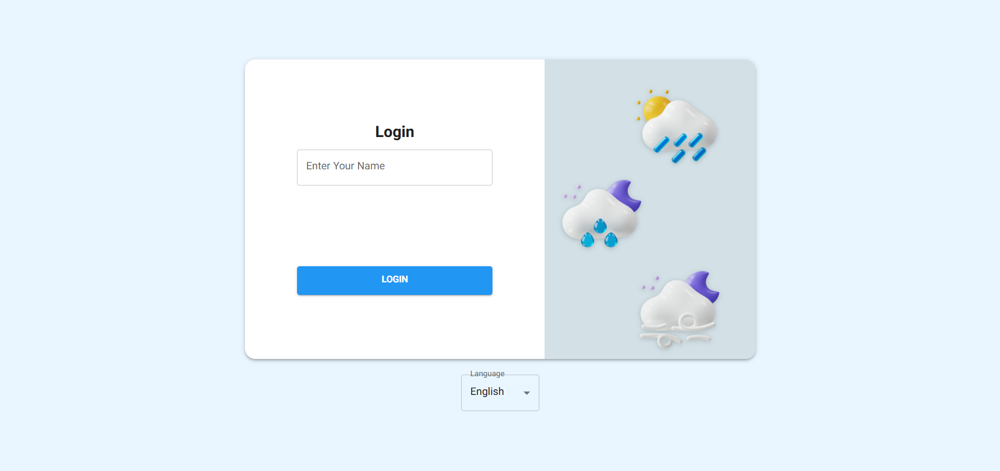
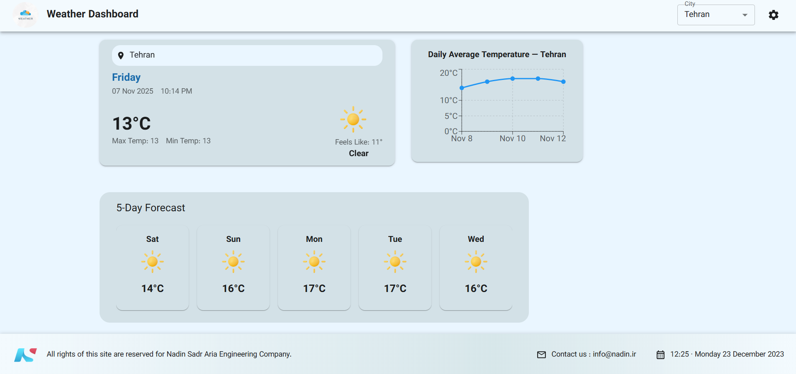
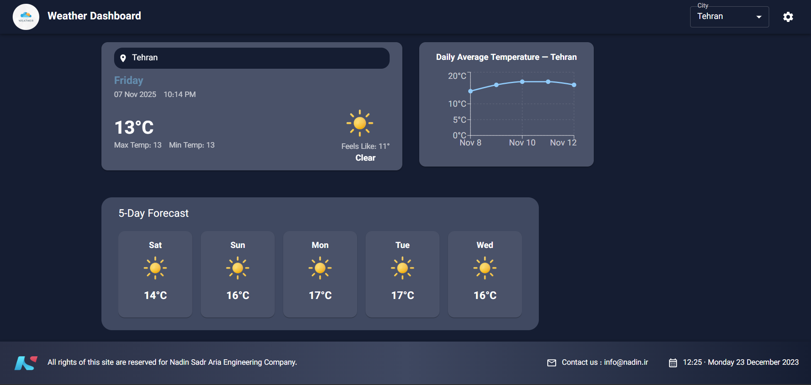

# 🌤️ NadinSoft Weather Dashboard

A responsive, bilingual weather dashboard built with **React (Vite + TypeScript)** and **Material UI**, developed as part of the NadinSoft Frontend Task.

---

## 🚀 Features

- **🔐 Login / Logout Flow**  
  Simple login page that takes a user name and navigates to the main weather dashboard.  
  Includes a logout button that returns the user to the login page.

- **🌦️ Real-Time Weather Data**  
  Uses **Axios** to fetch current and forecast weather data from the **OpenWeather API**.

- **🌓 Light / Dark Theme**  
  Fully supports Material UI theming with a user-controllable theme toggle.

- **🌍 Bilingual (i18n)**  
  Built with **react-i18next** supporting **English** and **Persian (Farsi)** languages.  
  The user can switch between languages dynamically within the app.

- **📱 Responsive Layout**  
  Optimized for all screen sizes using Material UI Grid system and responsive typography.

- **⚡ Performance Optimizations**  
  Includes **lazy loading** for main dashboard components, reducing initial bundle size.

---

## 🧱 Project Structure

```
src/
 ├── api/
 │   └── api.ts              # Axios configuration and weather API requests
 ├── components/
 │   ├── CurrentWeather.tsx  # Displays current weather conditions
 │   ├── WeatherDetails.tsx  # Shows humidity, wind, and other details
 │   └── ForecastList.tsx    # Displays 5-day forecast data
 ├── context/
 │   ├── CityContext.tsx     # Global city context for selected city
 │   └── LanguageContext.tsx # Global language management context
 ├── pages/
 │   ├── Login.tsx           # Login screen
 │   └── Dashboard.tsx       # Main weather dashboard
 ├── theme/
 │   └── theme.ts            # Light and dark Material UI themes
 ├── i18n/
 │   ├── en.json             # English translation strings
 │   └── fa.json             # Persian translation strings
 ├── utils/
 │   └── icons.ts            # Weather icon mapping for conditions
 ├── App.tsx
 ├── main.tsx
 └── index.css
```

---

## ⚙️ Setup Instructions

### 1. Clone the Repository

```bash
git clone https://github.com/Amir-ZoghiPeyman/nadinsoft-weather-dashboard.git
cd nadinsoft-weather-dashboard
```

### 2. Install Dependencies

```bash
npm install
```

### 3. Environment Variables

Create a `.env` file in the root directory and add your OpenWeather API key:

```bash
VITE_WEATHER_API_KEY=your_openweather_api_key
```

### 4. Run the Development Server

```bash
npm run dev
```

The app will be available at [http://localhost:5173](http://localhost:5173)

### 5. Build for Production

```bash
npm run build
```

---

## 🌐 API Reference

The project integrates with [OpenWeather API](https://openweathermap.org/api):

| Endpoint             | Description                 |
| -------------------- | --------------------------- |
| `/data/2.5/weather`  | Get current weather by city |
| `/data/2.5/forecast` | Get 5-day / 3-hour forecast |

Each request must include your API key, e.g.:

```
https://api.openweathermap.org/data/2.5/weather?q=Tehran&appid=YOUR_API_KEY&units=metric
```

---

## 🧩 Technologies Used

| Category             | Technology                        |
| -------------------- | --------------------------------- |
| **Framework**        | React 18 (Vite + TypeScript)      |
| **UI Library**       | Material UI v5                    |
| **HTTP Client**      | Axios                             |
| **Routing**          | React Router DOM                  |
| **Charts**           | Recharts                          |
| **State Management** | React Context API                 |
| **Localization**     | i18next                           |
| **Performance**      | React.lazy + Suspense             |
| **Theming**          | MUI Theme Provider (Light / Dark) |

---

## 📸 Screenshots

| Login Page                               | Dashboard (Light Mode)                   | Dashboard (Dark Mode)                  |
| ---------------------------------------- | ---------------------------------------- | -------------------------------------- |
|  |  |  |

---

## 🧠 Implementation Notes

- Implemented **lazy loading** for main dashboard components:
  - `CurrentWeather`
  - `WeatherDetails`
  - `ForecastList`
- Uses **Suspense** and **CircularProgress** as fallback loaders.
- Theme and language preferences are persisted using **localStorage**.
- All components are designed to be **fully responsive** and accessible.
- Includes **error and loading states** for API calls.

---

## 🧪 Development Tips

- **Translations:** Add new languages in `/src/i18n/`.
- **Theming:** Modify `theme.ts` to adjust typography, colors, or palettes.
- **API:** Update `api.ts` for custom endpoints or error handling.
- **Icons:** Extend the `weatherIconMap` for additional weather codes.

---

## 🧾 Task Reference

This project was built according to the **NadinSoft React.js Test Project** specifications:  
[📄 Nadin Soft Task - React.pdf](./Nadin%20Soft%20Task%20-%20React.pdf)

Figma Design: [View on Figma](https://www.figma.com/design/9pyq9bj4LaMOot6j0QAmur/Nadinsoft-Task---Frontend?node-id=0-1)

---

## 👨‍💻 Author

**Amir Zoghi**  
Frontend Developer  
📧 [zoghipeyman.amir@gmail.com]  
🌐 [https://github.com/Amir-ZoghiPeyman]

---

## 🪄 License

This project is open source and available under the [MIT License](LICENSE).
